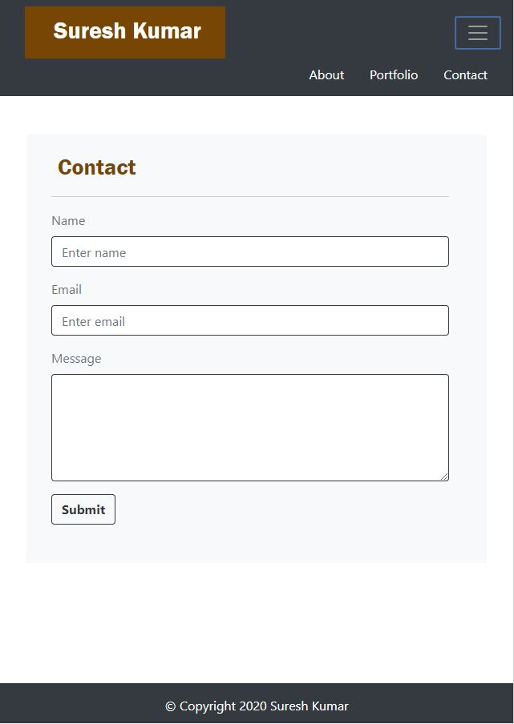

# responsivePortfolio
## Purpose
Use Bootstrap CSS framework to design a mobile responsive portfolio.

## Design:
The ResponsivePortfolio has 3 pages index.html, portfolio.html and contact.html.

The home page index.html has a brief bio about me, includes my picture, has professional social media links to learn more about my work and possibly connect and grow my professional network. ( linkedin, stackoverflow and github).

The porfolio page has links to the projects that are implemented as part of my portfolio.  Some of the projects are under construction and expected to be present in near future there with proper links.  Already implemented projects such as refactor and responsivePortfolio are properly linked to the live pages, so by clicking on them, it will take them to respective home pages of the projects.

The contact page helps to send message to me and has input fields such as Name , e-mail and text area.

All 3 pages are designed using responsive bootstrap 4 layouts and compoents so pages are responsive to screen size changes and work well on all viewport sizes and devices. The pages were validated using html validation services and is free of errors and warnings.

### The code repository for this work can be found at:
[repository](https://github.com/s-suresh-kumar/responsivePortfolio)

### The hosted web page for this work can be found at:
[Deployed Application](https://s-suresh-kumar.github.io/responsivePortfolio/)

## Usage 
Click  on [Deployed Application](https://s-suresh-kumar.github.io/responsivePortfolio/) to launch website to view the web page and click links at the top of page to navigate to respective page. Also resize the screen size of the browser and see the page is well behaved for small and large screen sizes alike. Access the page in mobile device and see it is well behaved. Also try on different browsers and see that the page is properly viewable.

## Some sample screenshots on windows PC:

### On screen width 640:  

#### 640-index.jpg:  

  

  

#### 640-index-expanded-ham.jpg

  

  

#### 640-portfolio.jpg:

  

#### 640-portfolio-expanded-ham.jpg

  
  

#### 640-contact.jpg:

  
  

#### 640-contact-expanded-ham.jpg

  
  

### On screen width 768:
  

#### 768-index.jpg:

  
  

#### 768-portfolio.jpg:

  
 
#### 768-contact.jpg:

  

    
### On screen width 980:
  

#### 980-index.jpg:

  
  
  
#### 980-portfolio.jpg:

  
  

#### 980-contact.jpg:

  
  
